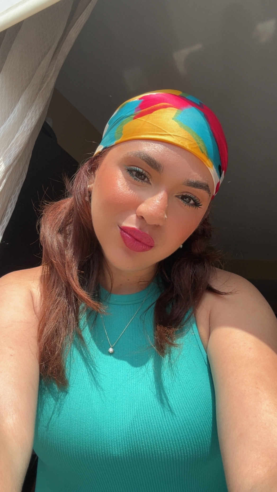

🔬 **Industrial Microbiology Undergrad @ UPRM** | 🌿 **Wildlife Conservationist & Field Technician** | 🐾 **Animal Care Specialist**

---

### 🌿 About Me

I am a proactive and creative researcher with a deep passion for wildlife conservation, ecology, and animal care. I am dedicated to protecting biodiversity through science, leadership, and community action. 

When I’m not in the lab or in the field, I manage domestic animal care services through **Woof & Meow Buddies**, tutor students, or participate in environmental and community outreach initiatives.

---

### 🔬 Research & Fieldwork Highlights

- **Yellow-Shoulder Blackbird Project:** Field technician working with Ecological Conservation PR & MC Environmental Specialists at CRCD.
- **Amphibian Conservation:** Field & lab technician studying adaptive strategies for Puerto Rican amphibian populations (*Eleutherodactylus wightmanae*)
- **Herpetology & Morphology:** Worked on dissections and morphological studies of invasive snakes (*BOA Constrictor & Pythons Morphology*) and native fossorial reptiles (*Amphisbaena* & *Typhlops*)
- **Guánica Dry Forest Restoration:** Participated in field efforts supporting reproduction habitats for the endangered *Sapo Concho* (*Peltophryne lemur*) at Ballena Beach.

---

# R Tutorials
- [Assignment 1](homework/tarea1.html)
- [Assignment 2](homework/tarea2.html)
- [Assignment 3](homework/tarea3.html)
